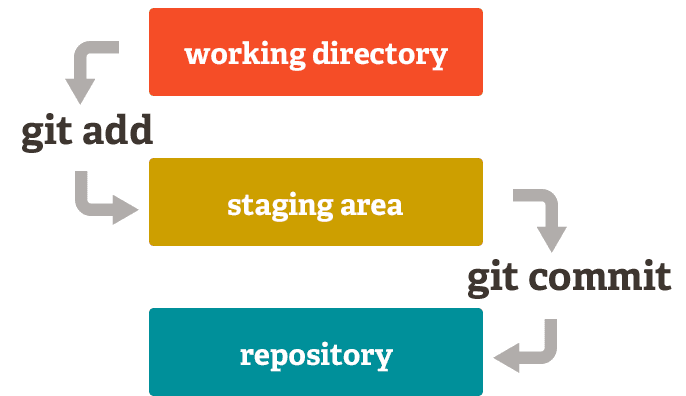

# Curso de Git  

`V2.23.0`

_Git es un sistema de control de versiones distribuido gratuito y de código abierto diseñado para manejar todo, desde proyectos pequeños hasta muy grandes, con rapidez y eficiencia._

_Git es fácil de aprender y tiene una huella pequeña con un rendimiento increíblemente rápido, y tiene características como ramificación local, áreas de preparación convenientes y múltiples flujos de trabajo ._

## Comando basico

- git init
- git add <file>
- git status
- git commit
- git push
- git pull
- git clone

## Areas de Git: Working directory,Staging area y Repository.

---

git hay tres area: **_working directory_**
es la carpeta de trabajo, y con git add pasamos al otro estado que es **_staging area_**, es donde va esta agregando todos los archivo para guardarlo y para para pasar al area final se hace con git commit pasas a esta area de **_repository_** que no es mas repositorio git de nuestro proyecto.

### Comandos Baiscos de GIT:

`git ini`: Se utiliza para crear un proyecto, O voy empezar a utilizar git en mi proyecto.

#### Los comando de Configuración Inicial de `git config`

`git config --global user.email`: Es sirve para configura el email de formal global de mi proyecto git.
`git config --global user.name`: Se Utiliza para colocar el usuarios o nombre de programador en mi proyecto git.

`git ini`: Se utiliza para crear un proyecto, O voy empezar a utilizar git en mi proyecto.

`git add`: Su funcion es pasar los archivos desde working directory, a area dos staging area.

`git status`: Es que me dice el estatus de mis archivo en que area, se encuentran mis archivos.

`git commit`: Crear una Foto o Snapshot que pasa los archivos Staging area al Repository.

`git push`: Es para subir mi archivo a un repositorio remoto (**_GitHub o GitLab_**)

`git pull`: Se utiliza para traerse de nuestro repositorio remoto los cambio hechos a a los archivos los otros desarrolladores.

`git clon`: Lo que hace hacer una copia de desde el servidor central donde esta los archivos con los codigo a mi computadora local.

`git log`: me visualiza los registro de los commit realizados.

`git checkout -- archivo`:Devuelve los cambio ante del commit es decir pasa a su area inicial working directory es decir pasa staging area al primera area que es working directory.

`git diff -- archivo`:Veo la diferencia de los archivos ante de commit inicial lo que hay staging area.

Oficial puenden descargar git:\_
[Git Descargar](https://git-scm.com/download/win 'Pagina Oficial')

##### final día V2.23.0

